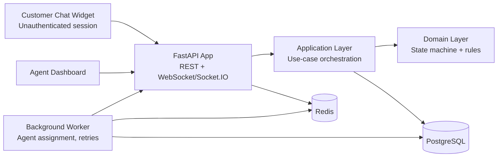

# E-commerce Support Chat - System Architecture (Python Stack)

## 1. Goal and Scope

This design targets a production-ready support chat system with:
- instant FAQ bot replies,
- seamless handoff to human agents,
- strict conversation lifecycle correctness (`AUTOMATED -> AGENT -> CLOSED`),
- persistence and refresh resilience,
- clean extensibility for scale.

This phase establishes architecture and domain boundaries. Full endpoint/business implementation is intentionally deferred.

## 2. Architectural Style

Use a **modular monolith** first, with boundaries ready for service extraction later.

Why this is the right first step:
- lower operational complexity than microservices,
- faster delivery for interview timeline,
- clear module boundaries (`domain`, `application`, `infra`) that can be split when scale demands.

## 3. High-Level Components

## 4. Core Domain Model

### Conversation
- `id (UUID)`
- `customer_session_id (string)`
- `status (automated|agent|closed)`
- `assigned_agent_id (nullable UUID)`
- `requested_agent_at (nullable timestamp)`
- `closed_at (nullable timestamp)`
- `created_at`, `updated_at`

### Message
- `id (UUID)`
- `conversation_id (UUID)`
- `sender_type (customer|bot|agent|system)`
- `sender_agent_id (nullable UUID)`
- `kind (text|quick_reply|event)`
- `content (text)`
- `metadata_json (jsonb)`
- `created_at`

### Agent
- `id (UUID)`
- `display_name`
- `presence (online|offline)`
- `max_active_chats`
- `created_at`, `updated_at`

### FAQ Entry
- `slug` (unique)
- `question`
- `answer`
- `display_order`
- `is_active`

## 5. Lifecycle and State Rules

Primary state machine:
- `AUTOMATED -> AGENT -> CLOSED`

Rules:
- new conversation starts in `AUTOMATED`.
- `Talk to agent` moves state to `AGENT` (idempotent on repeated clicks).
- only agent can transition `AGENT -> CLOSED`.
- `CLOSED` is read-only and terminal.

UI contract:
- show `Talk to agent` only in `AUTOMATED` mode.
- hide `Talk to agent` after handoff.

## 6. Realtime Strategy

Transport:
- Socket.IO or WebSocket channel per conversation.

Publish events:
- `message.created`
- `conversation.updated`
- `agent.assigned`
- `chat.closed`
- `agent.presence.changed`

Fallback:
- if socket disconnects, REST polling endpoint remains available for recovery.

## 7. Agent Assignment Strategy

Initial strategy:
- assign the least-loaded online agent (`active_open_chats` ascending).
- hard rule: max one assigned agent per conversation.
- if no agent is available:
  - keep conversation in `AGENT` mode,
  - keep `assigned_agent_id = null`,
  - add system message: `All agents are busy. You are in queue.`
  - worker retries assignment when presence/load changes.

This preserves user intent while keeping lifecycle simple.

## 8. Edge Case Handling

- multiple `Talk to agent` clicks:
  - idempotent operation, no duplicate assignment, no duplicate system messages.
- no agent available:
  - queued behavior as above.
- agent disconnects mid-chat:
  - mark agent offline; if disconnected threshold exceeded, unassign + requeue.
- customer refreshes page:
  - same `customer_session_id` restores active conversation and history.
- multiple agents online:
  - deterministic load-based assignment with DB transaction locking.

## 9. Consistency and Concurrency

Use DB transaction boundaries for:
- status transitions,
- agent assignment,
- message insert + conversation `updated_at` update.

Recommended locking:
- `SELECT ... FOR UPDATE SKIP LOCKED` on candidate agent rows for contention-safe assignment.

## 10. Security and Guardrails

- anonymous customer access with signed session token/cookie.
- server-side input validation and message length limits.
- optional rate limit for bot-triggered requests per session.
- audit-friendly system messages for key lifecycle events.

## 11. Scalability Path

When load increases:
- split into services (`chat-api`, `realtime-gateway`, `assignment-worker`),
- move event fanout to Redis Pub/Sub or Kafka,
- add read replicas for conversation history,
- preserve same domain contracts and event names.
